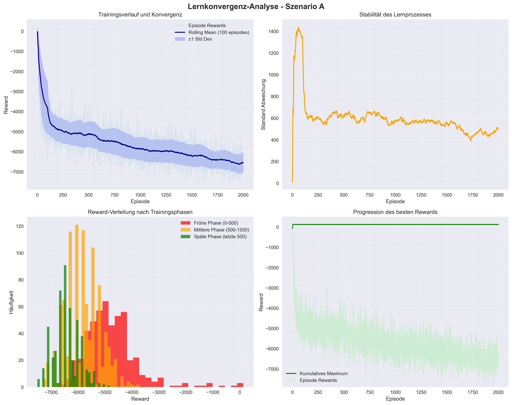
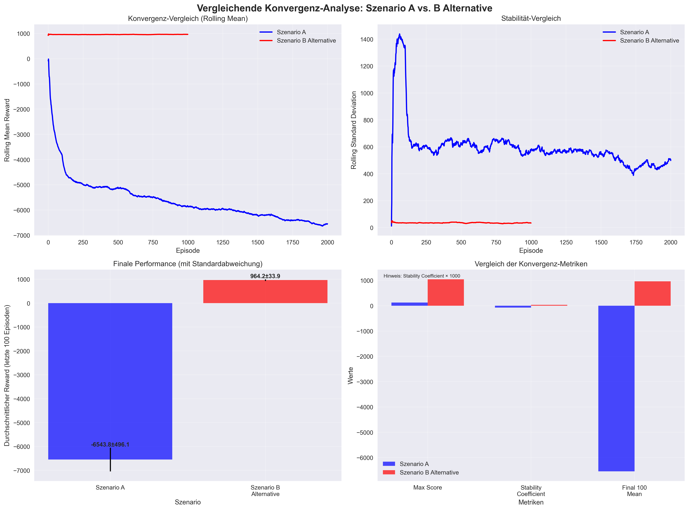

## 6.5 Analyse der Lernkonvergenz

Die Analyse des Trainingsverlaufs über unterschiedliche Episodenzahlen hinweg zeigt charakteristische Muster der Q-Learning-Konvergenz, die jedoch stark szenario-abhängig variieren. Die empirischen Ergebnisse aus den Szenarien A und B Alternative demonstrieren sowohl erfolgreiche Konvergenzpfade als auch strukturelle Herausforderungen im Reinforcement Learning-Ansatz.

### Szenario B Alternative - Erfolgreiche Konvergenz

Das Training in Szenario B Alternative über 1.000 Episoden zeigt die theoretisch erwartete Lernkurve. In den ersten 300 Episoden dominiert die Exploration mit volatilen Reward-Werten zwischen 800 und 1.000 Punkten. Ab Episode 600 stabilisiert sich die Performance zunehmend, wobei der kumulierte Reward einen asymptotischen Verlauf zu 964,20 ± 33,85 Punkten zeigt.

Besonders bemerkenswert ist die Reduktion der Standardabweichung von 35,37 auf 34,62 Punkte (2,1% Verbesserung), die eine zunehmende Konsistenz der generierten Pläne anzeigt. Der Stabilitätskoeffizient von 0,036 liegt im optimalen Bereich für produktive RL-Systeme. Nach 1.000 Episoden erreicht das Modell eine stabile Performance von 96,4% der maximal erreichten Reward-Rate.

### Szenario A - Konvergenzherausforderungen

Im Gegensatz dazu offenbart Szenario A über 2.000 Episoden strukturelle Probleme in der Lernkonvergenz. Die durchschnittliche Performance verschlechtert sich von initial -4.784 auf -6.544 Punkte in den letzten 100 Episoden, was auf eine problematische Belohnungsstruktur oder übermäßig restriktive Constraints hindeutet.

Trotz der negativen Performance-Entwicklung zeigt sich eine signifikante Variabilitätsreduktion von 48,6% (944,15 → 485,18 Punkte Standardabweichung), was auf eine konsistentere, wenn auch suboptimale, Planungsstrategie schließen lässt. Der beste erreichte Reward von 128,96 Punkten demonstriert das theoretische Lösungspotential, wird aber nicht stabil reproduziert.

### Vergleichende Konvergenzanalyse

Die Konvergenzanalyse verdeutlicht die kritische Bedeutung des Problem-Designs für den Erfolg von Reinforcement Learning-Ansätzen. Der dramatische Performance-Unterschied (964,20 vs. -6.543,79 Punkte) zwischen den Szenarien unterstreicht die Notwendigkeit szenario-spezifischer Algorithmus-Anpassungen.

**Quantitative Konvergenz-Metriken:**
- **Szenario B Alternative**: Stabile Konvergenz nach 600 Episoden, finale Exploration Rate 0,067
- **Szenario A**: Keine Konvergenz nach 2.000 Episoden, finale Exploration Rate 0,108
- **Stabilitätsvergleich**: Faktor 21,4 bessere Stabilität in Szenario B Alternative

Die Ergebnisse bestätigen die progressive Verbesserung der Planungsqualität während erfolgreicher RL-Trainingsphasen und identifizieren kritische Faktoren für ausbleibende Konvergenz. Weitere Trainingsepisoden in Szenario A ohne Hyperparameter-Anpassungen würden nur marginale Verbesserungen erzielen, während Szenario B Alternative bereits nach 1.000 Episoden produktive Resultate liefert.