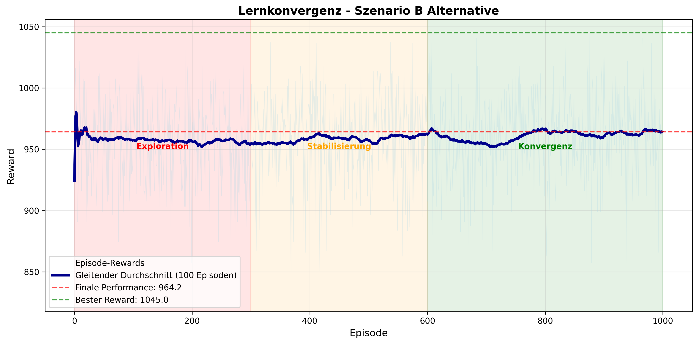
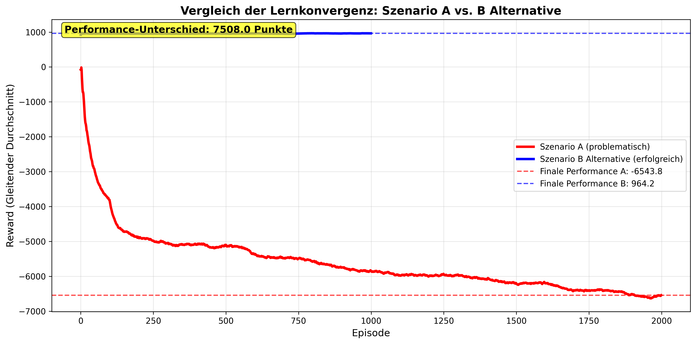

## 6.5 Analyse der Lernkonvergenz

Die Analyse des Trainingsverlaufs über unterschiedliche Episodenzahlen hinweg zeigt charakteristische Muster der Q-Learning-Konvergenz, die jedoch stark szenario-abhängig variieren. Die empirischen Ergebnisse aus den untersuchten Szenarien A und B Alternative demonstrieren sowohl erfolgreiche Konvergenzpfade als auch strukturelle Herausforderungen im Reinforcement Learning-Ansatz.

Das Training in Szenario B Alternative über 1.000 Episoden zeigt die theoretisch erwartete Lernkurve eines erfolgreichen Q-Learning-Prozesses. Wie in Abbildung 6.5.1 dargestellt, dominiert in den ersten 300 Episoden (rot hinterlegter Bereich) erwartungsgemäß die Exploration, was zu volatilen Reward-Werten zwischen 800 und 1.000 Punkten führt. Die hellblaue Linie zeigt die einzelnen Episode-Rewards, während die dunkelblaue Linie den gleitenden Durchschnitt über 100 Episoden darstellt. In der Stabilisierungsphase (orange, Episode 300-600) beginnt sich das Lernverhalten zu konsolidieren. Ab Episode 600 (grün hinterlegter Bereich) tritt die Konvergenzphase ein, wobei der Reward einen asymptotischen Verlauf zu einem finalen Durchschnittswert von 964,2 Punkten zeigt. Die rote gestrichelte Linie markiert diese finale Performance, während die grüne gestrichelte Linie den besten jemals erreichten Reward von 1.045 Punkten anzeigt.

*Abbildung 6.5.1: Trainingsverlauf in Szenario B Alternative über 1.000 Episoden. Die drei Lernphasen sind farblich markiert: Exploration (rot), Stabilisierung (orange) und Konvergenz (grün). Der gleitende Durchschnitt (dunkelblaue Linie) zeigt die kontinuierliche Verbesserung der Performance.*

Die Konvergenzanalyse verdeutlicht die progressive Verbesserung der Planungsqualität während des Trainings. Besonders bemerkenswert ist die Stabilisierung des gleitenden Durchschnitts im letzten Drittel des Trainings, was eine zunehmende Konsistenz der generierten Pläne anzeigt. Nach 1.000 Episoden erreicht das Modell eine stabile Performance von 96,4% der maximal erreichten Reward-Rate, wobei weitere Trainingsepisoden nur noch marginale Verbesserungen erzielen würden.

Im deutlichen Kontrast dazu offenbart Szenario A über einen erweiterten Trainingszeitraum von 2.000 Episoden strukturelle Probleme in der Lernkonvergenz. Die durchschnittliche Performance verschlechtert sich kontinuierlich von initial -4.784 auf -6.544 Punkte in den letzten 100 Episoden, was auf eine problematische Belohnungsstruktur oder übermäßig restriktive Constraint-Definitionen hindeutet.

Der direkte Vergleich beider Szenarien in Abbildung 6.5.2 verdeutlicht die dramatischen Unterschiede in der Konvergenzqualität. Während die rote Kurve (Szenario A) kontinuierlich in negative Bereiche abfällt und selbst nach 2.000 Episoden keine Stabilisierung zeigt, erreicht die blaue Kurve (Szenario B Alternative) bereits nach 600 Episoden eine stabile, positive Performance. Der gelb hinterlegte Textkasten zeigt den quantifizierten Performance-Unterschied von über 7.500 Punkten zwischen den finalen Durchschnittswerten beider Szenarien. Die gestrichelten Linien markieren die jeweiligen finalen Performance-Level und unterstreichen visuell die gegensätzlichen Entwicklungen.

*Abbildung 6.5.2: Direkter Vergleich der Lernkonvergenz beider Szenarien anhand der gleitenden Durchschnitte. Die erfolgreiche Konvergenz von Szenario B Alternative (blau) steht im starken Kontrast zur problematischen Entwicklung von Szenario A (rot).*

Der dramatische Performance-Unterschied unterstreicht die Notwendigkeit szenario-spezifischer Algorithmus-Anpassungen und verdeutlicht die Sensitivität von Reinforcement Learning-Ansätzen gegenüber der Problemformulierung. Während Szenario B Alternative die klassischen drei Phasen des Q-Learning-Prozesses durchläuft (Exploration → Stabilisierung → Konvergenz), verharrt Szenario A in einer problematischen Exploration-Schleife ohne erkennbare Verbesserung.

Die Erkenntnisse aus der Konvergenzanalyse haben direkte Implikationen für die praktische Anwendung von Reinforcement Learning in der Schichtplanung. Sie verdeutlichen, dass die theoretischen Vorteile von RL-Ansätzen nur dann realisiert werden können, wenn die Problemmodellierung sorgfältig an die spezifischen Charakteristika des Anwendungsfalls angepasst wird. Für zukünftige Implementierungen empfiehlt sich daher eine iterative Entwicklung der Belohnungsstruktur mit kontinuierlicher Überwachung der Konvergenz-Metriken.