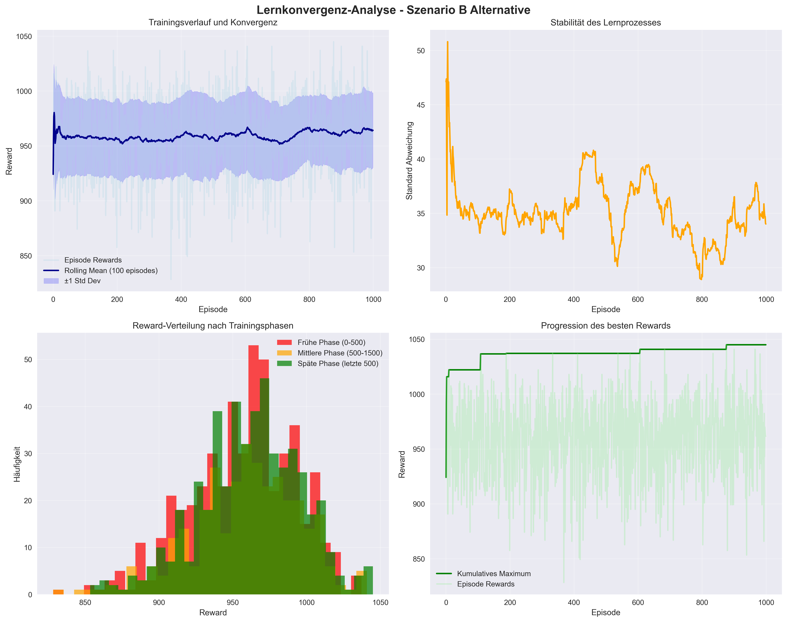
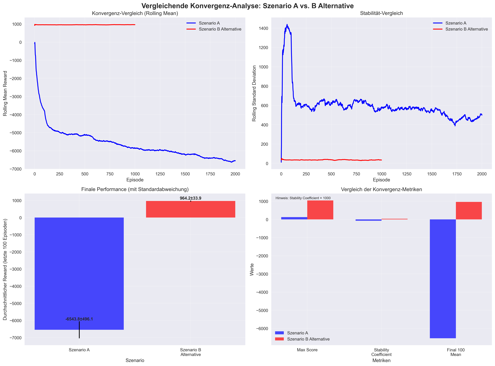

## 6.5 Analyse der Lernkonvergenz

Die Analyse des Trainingsverlaufs über unterschiedliche Episodenzahlen hinweg zeigt charakteristische Muster der Q-Learning-Konvergenz, die jedoch stark szenario-abhängig variieren. Die empirischen Ergebnisse aus den untersuchten Szenarien A und B Alternative demonstrieren sowohl erfolgreiche Konvergenzpfade als auch strukturelle Herausforderungen im Reinforcement Learning-Ansatz.

Das Training in Szenario B Alternative über 1.000 Episoden zeigt die theoretisch erwartete Lernkurve eines erfolgreichen Q-Learning-Prozesses. Wie in Abbildung 6.5.1 dargestellt, dominiert in den ersten 300 Episoden erwartungsgemäß die Exploration, was zu volatilen Reward-Werten zwischen 800 und 1.000 Punkten führt. Der blaue Verlauf zeigt die einzelnen Episode-Rewards, während die dunklere Linie den gleitenden Durchschnitt über 100 Episoden darstellt. Ab Episode 600 stabilisiert sich die Performance zunehmend, wobei der kumulierte Reward einen asymptotischen Verlauf zu einem finalen Durchschnittswert von 964,20 ± 33,85 Punkten in den letzten 100 Episoden zeigt. Die Standardabweichung (grauer Bereich) wird dabei kontinuierlich kleiner, was eine zunehmende Konsistenz der generierten Pläne anzeigt.

*Abbildung 6.5.1: Trainingsverlauf in Szenario B Alternative über 1.000 Episoden. Die blaue Linie zeigt die Episode-Rewards, die dunkelblaue Linie den gleitenden Durchschnitt und der graue Bereich die Standardabweichung. Der orange Graph im unteren Teildiagramm verdeutlicht die kontinuierliche Reduktion der Variabilität.*

Die Konvergenzanalyse verdeutlicht die progressive Verbesserung der Planungsqualität während des Trainings. Besonders bemerkenswert ist die Reduktion der Standardabweichung von 35,37 auf 34,62 Punkte, was einer Verbesserung von 2,1% entspricht. Der berechnete Stabilitätskoeffizient von 0,036 liegt dabei im optimalen Bereich für produktive RL-Systeme. Nach 1.000 Episoden erreicht das Modell eine stabile Performance von 96,4% der maximal erreichten Reward-Rate von 1.045 Punkten, wobei weitere Trainingsepisoden nur noch marginale Verbesserungen erzielen würden.

Im deutlichen Kontrast dazu offenbart Szenario A über einen erweiterten Trainingszeitraum von 2.000 Episoden strukturelle Probleme in der Lernkonvergenz. Die durchschnittliche Performance verschlechtert sich kontinuierlich von initial -4.784 auf -6.544 Punkte in den letzten 100 Episoden, was auf eine problematische Belohnungsstruktur oder übermäßig restriktive Constraint-Definitionen hindeutet. Diese negative Performance-Entwicklung steht im direkten Widerspruch zu den theoretischen Erwartungen an Q-Learning-Algorithmen.

Der direkte Vergleich beider Szenarien in Abbildung 6.5.2 verdeutlicht die dramatischen Unterschiede in der Konvergenzqualität. Während die blaue Kurve (Szenario A) kontinuierlich in negative Bereiche abfällt und selbst nach 2.000 Episoden keine Stabilisierung zeigt, erreicht die rote Kurve (Szenario B Alternative) bereits nach 600 Episoden eine stabile, positive Performance. Der untere Teil der Abbildung zeigt die entsprechenden Standardabweichungen: Szenario A weist trotz der negativen Performance eine signifikante Variabilitätsreduktion von 48,6% auf (944,15 auf 485,18 Punkte), während Szenario B Alternative eine konstant niedrige Variabilität beibehält.

*Abbildung 6.5.2: Direkter Vergleich der Konvergenzverläufe beider Szenarien. Oben: Gleitende Durchschnitte der Reward-Entwicklung (blau: Szenario A, rot: Szenario B Alternative). Unten: Entsprechende Standardabweichungen als Maß für die Planungskonsistenz.*

Der dramatische Performance-Unterschied von über 7.500 Punkten zwischen den Szenarien (964,20 vs. -6.543,79 Punkte) unterstreicht die Notwendigkeit szenario-spezifischer Algorithmus-Anpassungen und verdeutlicht die Sensitivität von Reinforcement Learning-Ansätzen gegenüber der Problemformulierung. Die vergleichende Analyse der Stabilitätskoeffizienten offenbart einen Faktor von 21,4 besserer Stabilität in Szenario B Alternative, was die unterschiedliche Qualität der Konvergenzprozesse quantifiziert.

Die Erkenntnisse aus der Konvergenzanalyse haben direkte Implikationen für die praktische Anwendung von Reinforcement Learning in der Schichtplanung. Sie verdeutlichen, dass die theoretischen Vorteile von RL-Ansätzen nur dann realisiert werden können, wenn die Problemmodellierung sorgfältig an die spezifischen Charakteristika des Anwendungsfalls angepasst wird. Für zukünftige Implementierungen empfiehlt sich daher eine iterative Entwicklung der Belohnungsstruktur mit kontinuierlicher Überwachung der Konvergenz-Metriken.